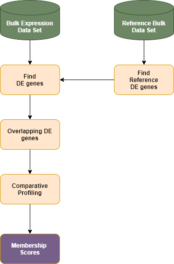

*************************************
Comparative Profiling
*************************************

Dprofiler allows users to incorporate silhouette measures and non-negative least squares (NNLS)-based membership scores to profile submitted bulk RNA samples given external reference bulk samples.  

The gene expression profiles of the external reference bulk samples are often limited to genes of interest where Dprofiler uses an overlapping set of differentially expressed genes of submitted data set and gene profiles of reference bulk data sets to compute membership scores. The membership score of each submitted sample is calculated by:

* finding overlapping genes across submitted and reference bulk RNA expression datasets.
* choosing profiles and mean expression profiles of conditions within the reference expression dataset 
* calculate the membership score using the similarity between submitted profiles and reference profiles .

	
|

Dprofiler also provides a connection to `DolphinMeta (Dmeta) <https://dmeta.readthedocs.io/en/latest/>`_ to import reference bulk expression
profiles across numereous publically available data sets.