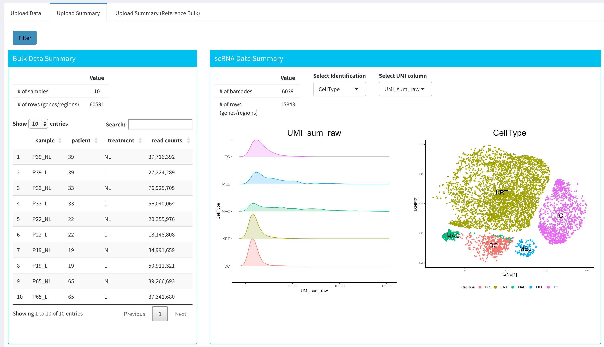
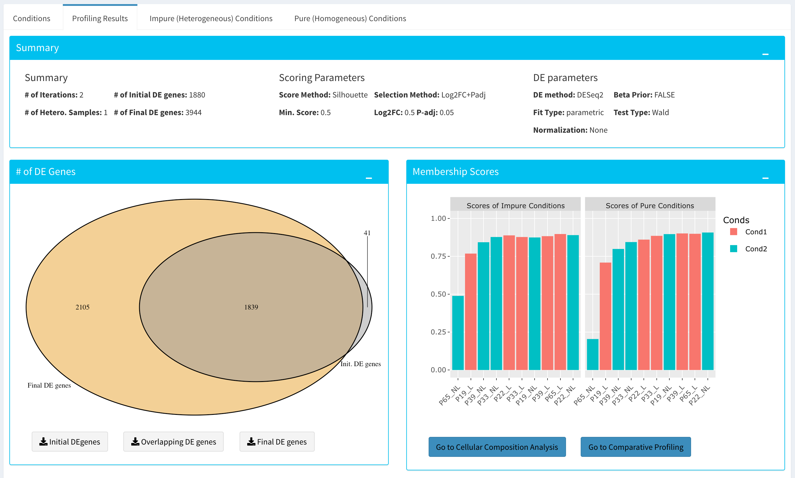

*****************
Quick-start Guide
*****************

This guide is walkthrough for the Dprofiler from start to finish.

Getting Started
===============

First off, we need to install R package of Dprofiler from bioconductor::

    source("https://bioconductor.org/biocLite.R")
    biocLite("dprofiler")

One you have installed the R package, you can call these R commands::

	library(dprofiler)
	startDprofiler()

.. note::

	For more information on installing Dprofiler locally, please consult our `Installation Guide <http://dprofiler.readthedocs.io/en/latest/local/local.html>`_.

Once you've made your way to the website, or you have a local instance of Dprofiler running, you will be greeted with data loading section:

.. image:: ../dprofiler_pics2/data_load.png
	:align: center

To begin the analysis, you need to upload your data files (comma or semicolon separated, i.e. ".csv", or tab separated, i.e. ".tsv", format) to be analyzed and choose appropriate separator for the file (comma, semicolon or tab).

There are three types of input data or objects in Dprofiler. These are:

* **Reference Bulk Expression Data:** used for detecting heterogeneous samples within each phenotypic group and detect  homogeneous subpopulations within each group (and for scoring samples of Profiling Expression data later).
* **scRNA Expression Data Object:** used for validating scores of each sample within Reference Bulk Expression Data and for conducting cellular RNA deconvolution analysis. 
* **Profiling Bulk Expression Data:**	used for scoring samples with the condition-specific expression profiles derived from homogeneous subpopulations of phenotypic groups from Reference Bulk Expression Data.

For both Reference and Profiling Bulk Expression Data sets, there are two distinct inputs given in '.txt', '.csv' or '.tsv' formats. These are Count Data File and Metadata File where metadata is optional

However, for scRNA data set, the user should provide an ExpressionSet object in rds format.

If you do not have a dataset to upload, you can use the built in demo data file by clicking on the 'Load Demo PRJNA554241 ' button that loads a case study. To view the entire demo data file, you can open

* `PRJNA554241 <https://www.ncbi.nlm.nih.gov/bioproject/PRJNA554241>`_: RNA-Seq count data of 5 Vitiligo patient whose lesional and non-lesional skin samples were collected 
* **scRNA Expression Data Object:** 
* `GSE65127 <https://www.ncbi.nlm.nih.gov/geo/query/acc.cgi?acc=GSE65127>`_: Microarray data of 10 healthy and 10 Vitiligo patients with lesional, non-lesional and peri-lesional samples collected. 

An example structure of the count data files are shown below:

========  ======  ======  ======  ======  ======  ======  ======  ======  ======  ====== 
gene      P39_NL  P39_L   P33_NL  P33_L   P22_NL  P22_L   P19_NL  P19_L   P65_NL  P65_L
========  ======  ======  ======  ======  ======  ======  ======  ======  ======  ======
A1BG      46      29      104     27      42      17      65      101     27      32
A1BG-AS1  27      18      48      13      10      3       39      54      23      24
A1CF      5       0       38      15      2       0       4       7       0       3
========  ======  ======  ======  ======  ======  ======  ======  ======  ======  ======

.. tip::

	Dprofiler also accepts count data files via hyperlink, for more information please see the `autoload data via hyperlink <quickstart.html#autoload-data-via-hyperlink>`_ section.

In addition to the count data file; you might need to upload metadata files to correct for batch effects or any other normalizing conditions you might want to address that might be within your results. To handle for these conditions, simply create a metadata file by using the example table at below or download sample file from `this link <https://bioinfo.umassmed.edu/pub/dprofiler/simple_demo_meta.txt>`_. Metadata file also simplifies condition selection for complex data. The columns you define in this file can be selected in condition selection page. Make sure you have defined two conditions per column. If there are more than two conditions in a column, those can be defined empty. Please note that, if your data is not complex, metadata file is optional, you don't need to upload. 

In the example below, the "patient" column may serve as a batch or a normalizing condition.  

============  =======  =========
sample        patient  treatment
============  =======  =========
P39_NL        P39      NL
P39_L         P39      L
P33_NL        P33      NL
P33_L         P33      L
P22_NL        P22      NL
P22_L         P22      L
P19_NL        P19      NL
P19_L         P19      L
P65_NL        P65      NL
P65_L         P65      L      
============  =======  =========

Metadata file can be formatted with comma, semicolon or tab separators similar to count data files. These files used to establish different batch effects for multiple conditions. You can have as many conditions as you may require, as long as all of the samples are present. 

Once the count data and metadata files have been loaded in Dprofiler, you can click upload button to visualize your data as shown at below:

You have the option to search samples or other terms within Reference or Profiling Expression data sets, and you also have the option to visualize the t-SNE and other numeric measures of your cells with the uploaded scRNA expression data object. 

After reviewing your uploaded data in "Upload Summary" panel, and if specified the metadata file containing your batch correction fields, you then have the option to filter low counts and conduct batch effect correction prior to your analysis. Alternatively, you may skip these steps and directly continue with heterogeneous differential expression analysis.

Low Count Filtering
===================

In this section, you can simultaneously visualize the changes of your Reference Expression data set while filtering out the low count genes. Choose your filtration criteria from **Filtering Methods** box which is located just center of the screen. Three methods are available to be used:

* **Max:** Filters out genes where maximum count for each gene across all samples are less than defined threshold. 
* **Mean:** Filters out genes where mean count for each gene are less than defined threshold. 
* **CPM:**	First, counts per million (CPM) is calculated as the raw counts divided by the library sizes and multiplied by one million. Then it filters out genes where at least defined number of samples is less than defined CPM threshold.

After selection of filtering methods and entering threshold value, you can proceed by clicking **Filter** button which is located just bottom part of the **Filtering Methods** box. On the right part of the screen, your filtered dataset will be visualized for comparison as shown at figure below. 

.. image:: ../dprofiler_pics2/filtering.png
	:align: center
	:width: 99%

You can easily compare following features, before and after filtering: 

* Number of genes/regions.
* Read counts for each sample.
* Overall histogram of the dataset.
* gene/region vs samples data 

.. important::

	To investigate the gene/region vs samples data in detail as shown at below, you may click the **Show Data** button, located bottom part of the data tables. Alternatively, you may download all filtered data by clicking **Download** button which located next to **Show Data** button.  

.. image:: ../dprofiler_pics2/show_data.png
	:align: center
	:width: 70%

Afterwards, you may continue your analysis with **Batch Effect Correction** or directly jump to Differential Heterogeneity Analysis of your dataset.

Batch Effect Correction and Normalization
=========================================
If specified metadata file containing your batch correction fields, then you have the option to conduct batch effect correction prior to your analysis. By adjusting parameters of **Options** box, you can investigate your character of your dataset. These parameters of the options box are explained as following:

* **Normalization Method:** Dprofiler allows performing normalization prior the batch effect correction. You may choose your normalization method (among MRN (Median Ratio Normalization), TMM (Trimmed Mean of M-values), RLE (Relative Log Expression) and upperquartile), or skip this step by choosing **none** for this item. For our sample data, we are going to choose MRN normalization.
* **Correction Method:** Dprofiler uses `ComBat <https://bioconductor.org/packages/release/bioc/vignettes/sva/inst/doc/sva.pdf>`_ (part of the SVA bioconductor package) or `Harman <https://www.bioconductor.org/packages/3.7/bioc/vignettes/Harman/inst/doc/IntroductionToHarman.html>`_ to adjust for possible batch effect or conditional biases. For more information, you can visit following links for documentation: `ComBat <https://bioconductor.org/packages/release/bioc/vignettes/sva/inst/doc/sva.pdf>`_, `Harman <https://www.bioconductor.org/packages/3.7/bioc/vignettes/Harman/inst/doc/IntroductionToHarman.html>`_ For our sample data, Combat correction was selected.
* **Treatment:** Please select the column that is specified in metadata file for phenotypic comparisons, such as cancer vs control.
* **Batch:** Please select the column name in metadata file which differentiate the batches. 
	
Upon clicking submit button, comparison tables and plots will be created on the right part of the screen as shown below.

.. image:: ../dprofiler_pics2/batch.png
	:align: center
	:width: 99%
	
.. image:: ../dprofiler_pics2/batch_PCA.png
	:align: center
	:width: 99%

.. image:: ../dprofiler_pics2/batch_IQR.png
	:align: center
	:width: 99%

.. image:: ../dprofiler_pics2/batch_density.png
	:align: center
	:width: 99%

You can investigate the changes on the data by comparing following features:

* Read counts for each sample.
* PCA, IQR and Density plot of the dataset.
* Gene/region vs samples data

.. tip::

  You can investigate the gene/region vs samples data in detail by clicking the **Show Data** button, or download all corrected data by clicking **Download** button.

Since we have completed **batch effect correction and normalization** step, we can continue with 'Go to Differential Heterogeneity Analysis'. This takes you to page where differential heterogeneity analysis is conducted with popular DE analysis methods like DESeq2, EdgeR or Limma. 

Differential Heterogeneity Analysis
===================================

The first option, 'Go to Heterogeneous Differential Analysis', takes you to the next step where scoring of samples and heterogeneity analysis takes place. 

* **Sample Selection:** In order to run the analysis, you first need to select the samples which will be compared. To do so, choose **Select Meta** box as **treatment** to simplify fill ``Condition 1`` and ``Condition 2`` based on the **treatment** column of the metadata as shown below.

        .. image:: ../dprofiler_pics2/score_condition_selection.png
	       :align: center

If you need to remove samples from a condition, simply select the sample you wish to remove and hit the delete/backspace key. In case, you need to add a sample to a condition you can click on one of the condition text boxes to bring up a list of samples and then click on the sample you wish to add from the list and it will be added to the textbox for that comparison.

    .. tip::

* **Scoring Parameters:** Two scoring methods are available for Dprofiler: Silhouette and NNLS-based.
  
  * Silhouette method incorporates Spearman correlation measures between samples of the same phenotypic condition to estimate the magnitude of similarity between a particular sample and all other samples in the same group.
  
  * NNLS-based method fits a non-negative regression model with a sample being the response and condition-specific (mean) expression profiles of conditions are input variables.
    
Both methods produce measure between (0,1) where lower values (or scores) indicate low membership score (or high heterogeneity) indicating that the sample is dissimilar to other samples in the same group.  
    
* **DE Parameters:** Three DE methods are available for Dprofiler: DESeq2, EdgeR, and Limma. DESeq2 and EdgeR are designed to normalize count data from high-throughput sequencing assays such as RNA-Seq. On the other hand, Limma is a package to analyse of normalized or transformed data from microarray or RNA-Seq assays. We have selected DESeq2 for our test sample and showed the related results at below.

After clicking on the 'start' button, Dprofiler will analyze your comparisons and store the results into separate data tables. Upon finishing the Differential Heterogeneity analysis, There separate results tables will be produced:

* Differential Heterogeneity Detection. 
* Impure (Heterogeneous) Conditions.
* Pure (Homogeneous) Conditions. 
	
Differential Heterogeneity Detection
====================================

Upon finishing the Differential Heterogeneity analysis, the application will switch to "Differential Heterogeneity Detection" panel showing results of the analysis. Differentially expressed genes of initial DE analysis and Final DE analysis are compared. The app also informs you about the parameters of the Scoring and DE analysis. 

Additional information of initial and final DE genes can be found on plots below. Three **Scatter Plots** of initial and final genes, as well as the common genes in both list of DE genes will be plotted. You can switch to **Volcano Plot** and **MA Plot** by using **Plot Type** section at the left side of the *Discover** menu. Since these plots are interactive, you can click to **zoom** button on the top of the graph and select the area you would like to zoom in by drawing a rectangle. Please see the plots at below:

.. image:: ../dprofiler_pics2/ma_plot.png
  :align: center
  :width: 99%
  
.. image:: ../dprofiler_pics2/main_plot_filters.png
	:align: center
	:width: 35%
	
You can hover over the scatterplot points to display more information about the point selected. A few bargraphs will be generated for the user to view as soon as a scatterplot point is hovered over.
  
.. tip::

    Please keep in mind that to increase the performance of the generating graph, by default 10% of non-significant(NS) genes are used to generate plots. You might show all NS genes by please click **Main Options** button and change Background Data(%) to 100% on the left sidebar.

.. image:: ../dprofiler_pics2/example_background_data.png
    :align: center
    :width: 30%

Next, you can initiate a Cellular composition analysis using either the Homogeneouos or Heterogeneous conditions, and deconvolute the Reference bulk expression data using the reference scRNA expression data by clicking "Go to Cellular Composition". But before that, you can take a look at the DE genes of either initial or Final DE analysis from remaining panels. 

Impure and Pure Conditions 
==========================

There are two more panels on the right of Differential Heterogeneity Detection panel which take a closer look at
initial and final DE genes of the conditions. 

.. image:: ../dprofiler_pics2/initial_table.png
	:align: center
	:width: 99%

You can always download these results in CSV format by clicking the **Download** button. You can also download the plot or graphs by clicking on the **download** button at top of each plot or graph.

Cellular Composition Analysis 
=============================

By using the "Cellular Compositions" tab, you can determine which idents are to be used to deconvolute the Reference bulk expression data. You can also choose which of those cell types are to be used for the deconvolution as well. Then you can also decide whether DE genes of initial or final DE analysis are used to deconvolute the data. Finally, you should decide which column in the scRNA metadata that the samples are introduced, this is required by the MUSIC algorithm to give weight to genes that are less variant across different samples.  

After clicking the "Start" button, the results will be given in the "Cellular Composition" panel. Membership Scores and cell type fractions are given for each sample where each box of the table are highlighted with respect to cell type. 

	
You can also visualize count data of Reference bulk expression data set with respect to cellular markers. 

.. image:: ../dprofiler_pics2/composition_heatmap.png
	:align: center
	:width: 99%

Autoload Data via Hyperlink
===========================

Dprofiler also accepts TSV's via hyperlink by following conversion steps. First, using the API provided by Dolphin, we will convert TSV into an html represented TSV using this website::

	https://dolphin.umassmed.edu/public/api/

The two parameters it accepts (and examples) are:

	1. source=https://bioinfo.umassmed.edu/pub/dprofiler/advanced_demo.tsv
	2. format=JSON

Leaving you with a hyperlink for::

	https://dolphin.umassmed.edu/public/api/?source=https://bioinfo.umassmed.edu/pub/dprofiler/advanced_demo.tsv&format=JSON

Next you will need to encode the url so you can pass it to the Dprofiler website.
You can find multiple url encoders online, such as the one located at `this
link. <https://www.url-encode-decode.com/>`_.

Encoding our URL will turn it into this::

	http%3A%2F%2Fdolphin.umassmed.edu%2Fpublic%2Fapi%2F%3Fsource%3Dhttp%3A%2F%2Fbioinfo.umassmed.edu%2Fpub%2Fdprofiler%2Fadvanced_demo.tsv%26format%3DJSON

Now this link can be used in Dprofiler as::

	https://dprofiler.umassmed.edu:443/dprofiler/R/

It accepts two parameters::

	1. jsonobject= http%3A%2F%2Fdolphin.umassmed.edu%2Fpublic%2Fapi%2F%3Fsource%3Dhttp%3A%2F%2Fbioinfo.umassmed.edu%2Fpub%2Fdprofiler%2Fadvanced_demo.tsv%26format%3DJSON
	2. title= no

The finished product of the link will look like this::

	https://dprofiler.umassmed.edu:443/dprofiler/R/?jsonobject=https://dolphin.umassmed.edu/public/api/?source=https://bioinfo.umassmed.edu/pub/dprofiler/advanced_demo.tsv&format=JSON&title=no

Inputting this URL into your browser will automatically load in that tsv to be analyzed by Dprofiler!
